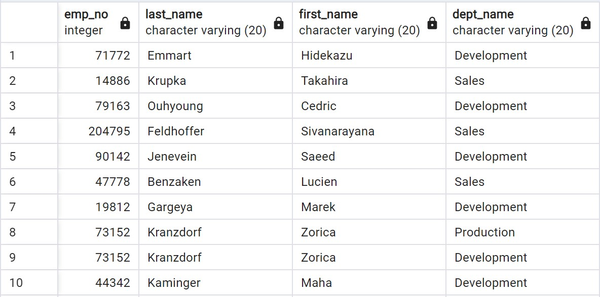

# sql-challenge

I am Andrea Ceriati, and this week I worked on the following assignment:

# Background

It’s been two weeks since you were hired as a new data engineer at Pewlett Hackard (a fictional company). Your first major task is to do a research project about people whom the company employed during the 1980s and 1990s. All that remains of the employee database from that period are six CSV files.

For this project, you’ll design the tables to hold the data from the CSV files, import the CSV files into a SQL database, and then answer questions about the data. That is, you’ll perform data modeling, data engineering, and data analysis, respectively.

# Instructions
This Challenge is divided into three parts: data modeling, data engineering, and data analysis.

## Data Modeling
Inspect the CSV files, and then sketch an Entity Relationship Diagram of the tables. To create the sketch, feel free to use a tool like QuickDBDLinks to an external site..

## Data Engineering
1. Use the provided information to create a table schema for each of the six CSV files. Be sure to do the following:

- Remember to specify the data types, primary keys, foreign keys, and other constraints.

- For the primary keys, verify that the column is unique. Otherwise, create a composite keyLinks to an external site., which takes two primary keys to uniquely identify a row.

- Be sure to create the tables in the correct order to handle the foreign keys.

2. Import each CSV file into its corresponding SQL table.

## Data Analysis

1. List the employee number, last name, first name, sex, and salary of each employee.

2. List the first name, last name, and hire date for the employees who were hired in 1986.

3. List the manager of each department along with their department number, department name, employee number, last name, and first name.

4. List the department number for each employee along with that employee’s employee number, last name, first name, and department name.

5. List first name, last name, and sex of each employee whose first name is Hercules and whose last name begins with the letter B.

6. List each employee in the Sales department, including their employee number, last name, and first name.

7. List each employee in the Sales and Development departments, including their employee number, last name, first name, and department name.

8. List the frequency counts, in descending order, of all the employee last names (that is, how many employees share each last name).

# Solution

## Data Modeling

I initially sketched the ERD using the following code with QuickDBD:

```txt
titles
-
title_id CHAR(5) PK
title VARCHAR(20)

employees
-
emp_no INT PK
emp_title_id VARCHAR(20) FK >- titles.title_id
birth_date DATE
first_name VARCHAR(20)
last_name VARACHAR(20)
sex CHAR(1)
hire_date DATE

departments
-
dept_no CHAR(4) PK
dept_name VARCHAR(20)

dept_emp
-
emp_no INT FK >- employees.emp_no PK
dept_no CHAR(4) FK >- departments.dept_no PK

dept_manager
-
dept_no CHAR(4) FK >- departments.dept_no PK
emp_no INT FK >- employees.emp_no PK

salaries
-
emp_no INT FK >- employees.emp_no PK
salary INT PK
```

<p align='center'> </p>

## Data Engineering

I than created a table schema for each of the six CSV files and imported each CSV file into its corresponding SQL table.
Find the first 10 rows of each table below:

<p align='center'> </p>

<p align='center'> </p>

<p align='center'> </p>

<p align='center'> </p>

<p align='center'> </p>

<p align='center'> </p>

## Data Analysis 

Find the first 10 rows of the tables created from each query below:

1. List the employee number, last name, first name, sex, and salary of each employee.

<p align='center'> </p>

2. List the first name, last name, and hire date for the employees who were hired in 1986.

<p align='center'> </p>

3. List the manager of each department along with their department number, department name, employee number, last name, and first name.

<p align='center'> </p>

4. List the department number for each employee along with that employee’s employee number, last name, first name, and department name.

<p align='center'> </p>

5. List first name, last name, and sex of each employee whose first name is Hercules and whose last name begins with the letter B.

<p align='center'> </p>

6. List each employee in the Sales department, including their employee number, last name, and first name.

<p align='center'> </p>

7. List each employee in the Sales and Development departments, including their employee number, last name, first name, and department name.

<p align='center'> </p>

8. List the frequency counts, in descending order, of all the employee last names (that is, how many employees share each last name). 

<p align='center'> </p>


# Repository

In this repository you can find: a README file, an "EmployeeSQL" folder containg a "Resources" folder with the six .csv files used for the task and an "image" folder with an image of the ERD skecthed initially with QuickDBD, an image of the final ERD, and a screenshot of all the tables produced during the assignment, a .sql file of the table schemata, and a .sql file of my queries.